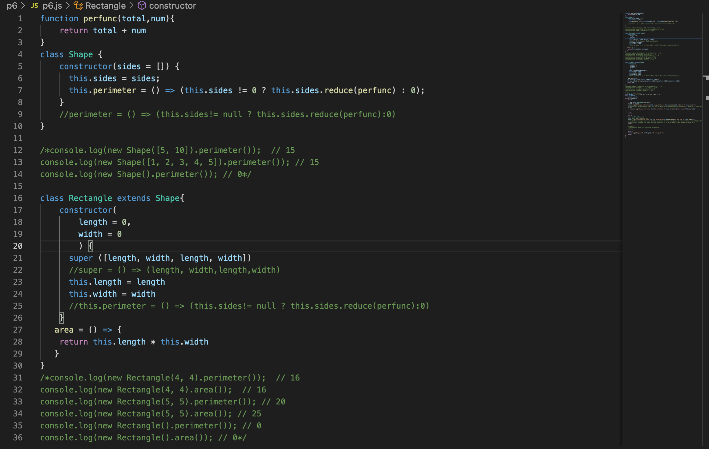

## Welcome to Project 6

This week Project we had to create a class that to find the perimeter and area for a rectangle and triangle. Creating a total of three classes but two had to extend the first class we created onto the other ones.

After completing this project, you will:

Gain experience creating and working classes with inheritance

Gain more experience creating and working with classes

Gain more experience debugging code

Gain more experience using a generic block of code to process data

Gain more experience interpreting functional descriptions and specifications to complete an assignment

Gain more experience writing and executing non-web server Node.js JavaScript code using VSCode

Practice using modern JavaScript syntax

Gain more experience working with static data

